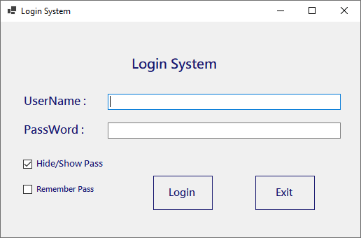
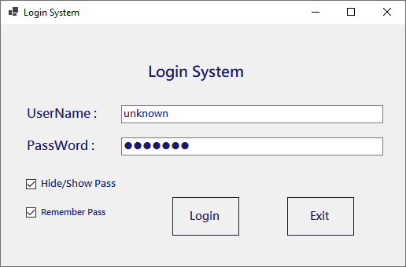
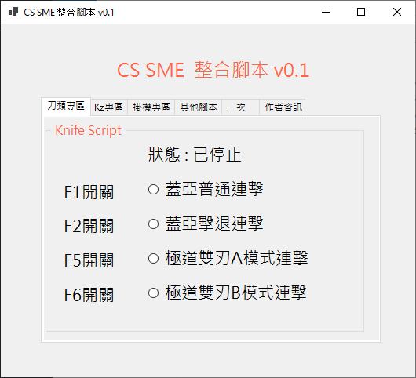
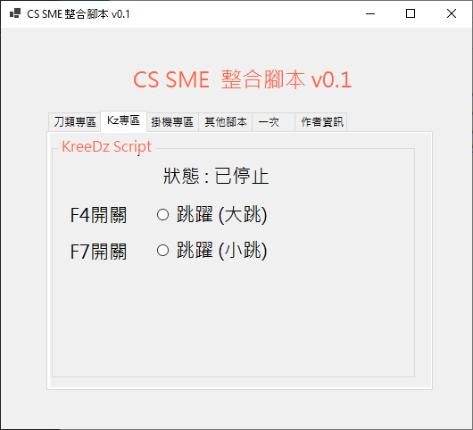
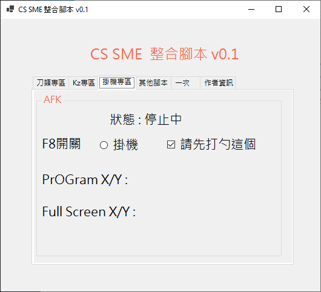
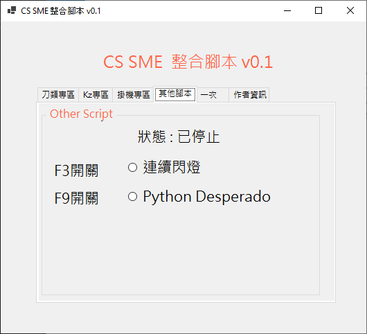
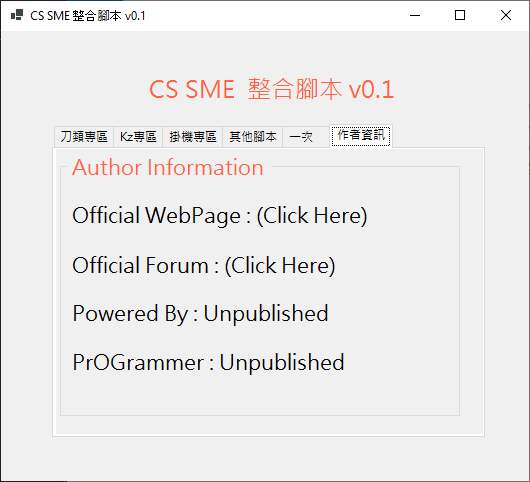

# CS SME MScript

**IMPORTANT: this project has no logner maintain**

This is a CS SME Script, a Multi Script, so i call this program "CS SME MScript", Just use the keyboard hotkeys and then you can toggle on/off the Script.

This project was made when I was in high school (F3-F4 2018-2019), gitlab just let me place this project. around 4 years ago, time really flies. Since i coding a lot of time on this project. so just let it put here :))

maybe one day i will come back continue maintain? idk, at least i need to play again CS SME.

At the time I was coding this program, CS SME had only released version 6.4.

## Features

i made some scripting for this CS SME script, below is list.

## Login

for the Login is just hardcode.

## Toggle Script

there have a lot of using F* to toggle the script.

- 蓋亞普通連擊 (F1 Toggle)
- 蓋亞擊退連擊 (F2 Toggle)
- 極道雙刃 A 模式連抨 (F5 Toggle)
- 極道雙刃 B 模式連抨 (F6 Toggle)
- 跳躍 (大跳) - (F4 Toggle)
- 跳躍 (弓跳) - (F7 Toggle)
- 掛機 - 自動操作移點 (F8 Toggle)
- 閃燈 (F3 Toggle)
- Python Desperado 自動連射 - (F9 開關)

## Keypress Script

using keypress to handle some script.

- 獵魂槍秒爆 (press `C`)

