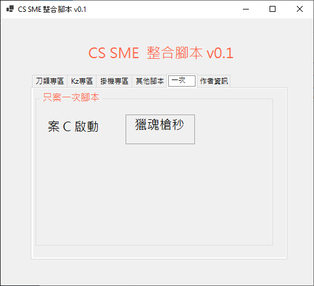

## CS SME MScript

Welcome to the CS SME Script, also known as `CS SME MScript`.

This project was created when CS SME was at version 6.4.

## Update for 2024

I developed this script during high school (F3-F4, 2018-2019). Previously, this project was closed-source, but I’ve decided to open-source it now.

### Will You Continue Development?

As I now use GNU/Linux as my daily-driven for a long time, Windows software is no longer a priority for me. Therefore, I’m not focusing on Windows-related updates and i prefer to work on GNU/Linux.

for short. `No`.

## How to Use

Use the keyboard hotkeys to toggle the script functions ON/OFF.

## Features

### Login

The login credentials are hardcoded.

### Script Functions

- **蓋亞普通連擊** (F1 Toggle)
- **蓋亞擊退連擊** (F2 Toggle)
- **極道雙刃 A 模式連抨** (F5 Toggle)
- **極道雙刃 B 模式連抨** (F6 Toggle)
- **跳躍 (大跳)** (F4 Toggle)
- **跳躍 (小跳)** (F7 Toggle)
- **掛機 - 自動操作移點** (F8 Toggle)
- **閃燈** (F3 Toggle)
- **Python Desperado 自動連射** (F9 Toggle)
- **獵魂槍秒爆** (Press `C`)

